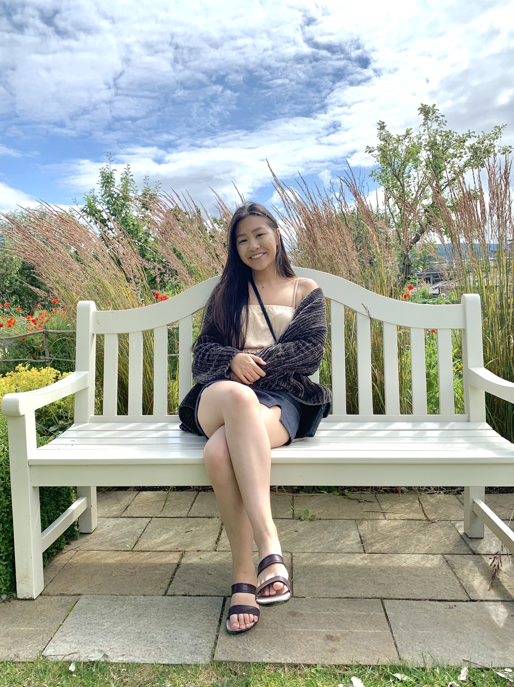

# Welcome to my Portfolio 

## Projects 

[SOCGEN 180 FINAL](SOCGEN.md) 

## About 

My name is Brittney Le and I am a fourth year Human Biology and Society, B.S student studying at the University of California, Los Angeles. I am creating this website in order to showcase some of my projects. This site is a current work in progress as I am learning how to build websites as well as create compelling narratives to publish. 

A little about me:
- I was born and raised in the heart of Silicon Valley, San Jose, California 
- My interests lie at the intersection of healthcare and technology 
- I will just park my car 2 blocks away if I see there's only parallel parking spaces and I will die on this hill. 

Thank you for viewing and you can [email](brittney2198@ucla.edu) me or contact me via my [Linkedin](linkedin.com/in/brittney-l-304852b4) for questions or to give me any feedback! 
